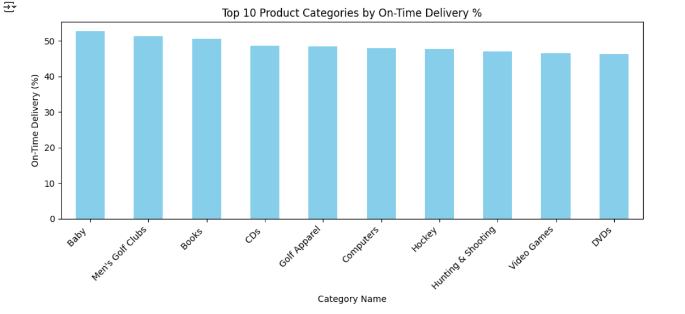
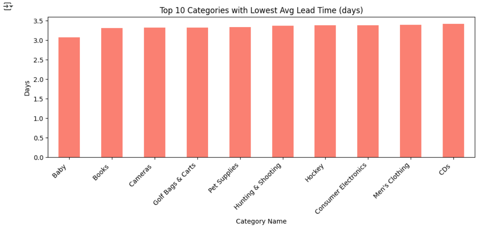
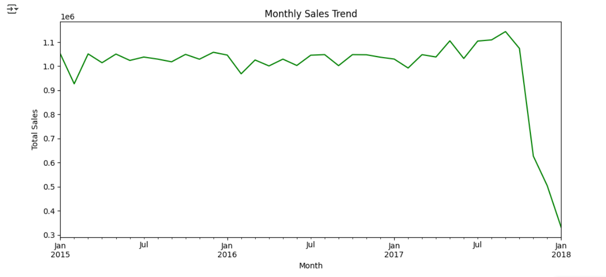

# Supply Chain & Demand Analysis

## 📌 Project Overview
This project analyzes a manufacturing company's supply chain data (zippers, buttons, snaps) to identify bottlenecks, seasonal trends, and inventory patterns.  
The goal is to improve **inventory management** and **on-time deliveries** through data-driven insights.

Dataset Source: [Kaggle - DataCo Smart Supply Chain](https://www.kaggle.com/datasets/shashwatwork/dataco-smart-supply-chain-for-big-data-analysis)  

---

## 🎯 Objectives
- Measure **On-Time Delivery (OTD)** performance.
- Detect **seasonal demand trends**.
- Evaluate **regional order performance**.
- Calculate **inventory turnover** by product category.
- Analyze **lead time bottlenecks**.

---

## 📊 Key KPIs Implemented
1. **On-Time Delivery (OTD) %** by category  
2. **Average Lead Time** per category  
3. **Inventory Turnover Ratio**  
4. **Monthly Sales Trends** (seasonality patterns)

---

## 📈 Methodology
1. **Data Cleaning**  
   - Removed missing critical values & duplicates  
   - Converted date columns to `datetime` format  
   - Created `lead_time_days` & `is_ontime` flags  

2. **KPI Calculation**  
   - Grouped data by `Category Name` for OTD, lead time, turnover  
   - Aggregated monthly sales for trend analysis  

3. **Visualization**  
   - Bar plots for OTD and lead time  
   - Line plot for monthly sales trend  

---
## 📌 Key Insights from Analysis

### 🚚 Supply Chain Performance
- **Highest Average Lead Time (Regions)**  
  1. Central Africa — 3.55 days  
  2. West Africa — 3.51 days  
  3. Eastern Asia — 3.50 days  
  4. East Africa — 3.49 days  
  5. Central America — 3.49 days  

- **Highest Average Lead Time (Categories)**  
  1. Strength Training — 3.73 days  
  2. Soccer — 3.69 days  
  3. As Seen on TV! — 3.62 days  
  4. DVDs — 3.62 days  
  5. Kids' Golf Clubs — 3.61 days  

### 📈 Seasonal Demand Trends
- Clear spikes in **monthly sales** during holiday seasons.  
- Certain product categories show higher sales during specific quarters.  

### 📦 Inventory & Order Performance
- Categories with high OTD % tend to have lower lead times.  
- Inventory turnover varies significantly by category — potential for optimization.

## 📷 Dashboard & Plots


Example:
  
  
  

---

## 🛠 Tech Stack
- Python  
- Pandas  
- Matplotlib  

---

## 🚀 How to Run
1. Clone this repo:  
   ```bash
   git clone https://github.com/Israttamu/supply-chain-analysis.git
   cd supply-chain-analysis


